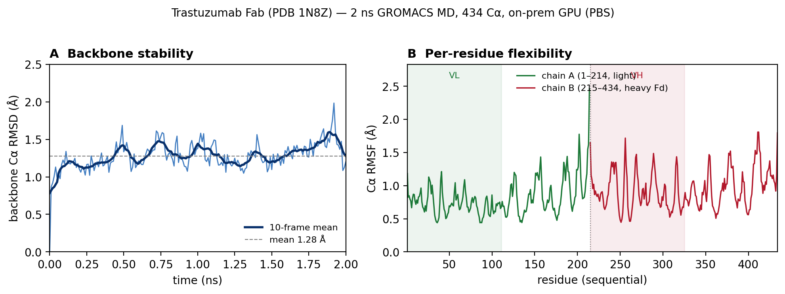

# Agentic Protein Workflow

> An **MCP-based Agentic AI** system: give it a PDB id in natural language and an
> LLM agent calls MCP tools to fetch the structure, predict aggregation-prone
> regions, submit a GROMACS MD job, poll it, and write an analysis report.

The MD step is abstracted on **two axes**:

- **Engine** — *what* computes the dynamics: **GROMACS** (`gmx mdrun`) or
  **OpenMM** (in-process Python API, auto CUDA/OpenCL/CPU).
- **Execution target** — *where* GROMACS runs: on-prem **Slurm** (GPU),
  **PBS** (CPU), or a **Colab/local** subprocess.

So the agent can pick a GROMACS run on a scheduler, or a zero-setup OpenMM run
right inside the server process — without caring about the mechanics.

> ⚠️ Public RCSB/UniProt data only. 

## Architecture

```
"Analyze aggregation risk of antibody 1N8Z and run a 100 ns MD"
        │
   ┌────▼─────────────┐   MCP tool calls
   │  LLM agent (host) │ ───────────────┐
   └──────────────────┘                 │
   structure_server     hpc_server (GROMACS)   analysis_server
   ├ fetch_structure    ├ submit_md_job ─┐     ├ analyze_trajectory
   └ extract_sequence   └ check_job      │     └ generate_report
                          backend=slurm ─┼─► sbatch + squeue (GPU)
                          backend=pbs ───┼─► qsub + qstat    (CPU)
                          backend=colab ─┘─► gmx mdrun subprocess (Colab/local)

   openmm_server (OpenMM)         ── in-process, no scheduler ──┐
   ├ run_openmm_md  ──────────────► CUDA / OpenCL / CPU (auto)  ┘
   └ list_platforms                 writes DCD → analyze_trajectory
```

## MCP servers
| Server | Tools | Role |
|--------|-------|------|
| `structure_server.py` | `fetch_structure`, `extract_sequence` | RCSB download, FASTA extraction |
| `hpc_server.py` | `submit_md_job`, `check_job` | GROMACS engine: Slurm/PBS/Colab backends |
| `openmm_server.py` | `run_openmm_md`, `list_platforms` | OpenMM engine: in-process, auto GPU/CPU |
| `analysis_server.py` | `analyze_trajectory`, `generate_report` | RMSD/RMSF/Rg + Markdown report |

## Quickstart
```bash
conda env create -f envs/environment.yml
conda activate agentic-protein-workflow
# register the three servers with an MCP client using configs/mcp_config.json
```

## Engine / backend selection
```python
# GROMACS engine (hpc_server) — pick where it runs
submit_md_job(deffnm="prod", backend="slurm")  # sbatch on the L40s cluster
submit_md_job(deffnm="prod", backend="pbs")    # qsub on idle iREMB CPU nodes
submit_md_job(deffnm="prod", backend="colab")  # gmx mdrun here (Colab demo)

# OpenMM engine (openmm_server) — in-process, no scheduler, auto GPU/CPU
run_openmm_md(pdb_path="work/1N8Z.pdb", nsteps=25000)
```
Cluster paths/credentials are read from `APW_*` env vars (see `configs/`) and
are never committed. The PBS backend loads GROMACS from the system module
(`APW_PBS_GMX_MODULE`, default `GROMACS/2025.02`) and defaults to CPU-only MD on
idle pilot nodes; set `APW_PBS_NGPUS>0` to request GPUs.

### Remote submission (path B): drive a cluster from your laptop
If the agent runs locally (e.g. the cluster login node has no outbound internet
for the LLM API), set `APW_REMOTE_CMD` to a remote-exec wrapper so `qsub`/`qstat`
run on the cluster while you keep staging files with WinSCP:
```jsonc
// OpenSSH (key in the Windows ssh-agent service — survives reboots, unattended):
"APW_REMOTE_CMD": "ssh -p 60026 -o BatchMode=yes <user>@<host>",
"APW_REMOTE_WORKDIR": "/scratch/<user>/agentic_runs"
// or plink (PuTTY/Pageant — must relaunch Pageant after each reboot):
// "APW_REMOTE_CMD": "plink -batch -load iremb_pbs",
```
The PBS script is piped to `qsub` over the channel's stdin (no file copy needed);
`check_job` polls `qstat` the same way. Any remote-exec wrapper works — `ssh`
(key in `ssh-agent`, persists across reboots) or `plink` (reuses your PuTTY
key via Pageant, relaunch after reboot). Accept the host key once interactively
before using batch mode.

To remove the last manual step, stage input files via the `stage_files` tool —
then stage+submit+poll all run from the laptop:
```jsonc
"APW_SCP_CMD": "scp -P 60026 -o BatchMode=yes",   // OpenSSH (or: "pscp -batch -P 60026")
"APW_REMOTE_TARGET": "<user>@<host>"
```
`stage_files(["1N8Z_fixed.pdb", "pbs_1n8z_pipeline.sh"])` → uploads to
`APW_REMOTE_WORKDIR`. No WinSCP needed.

### Run isolation — one directory per run (no clobbering)
Two GROMACS jobs writing the same folder overwrite each other's `em.*`, `md.*`,
`topol.top`, etc. To make this structurally impossible:
- `submit_md_job` creates a unique **`run_<job_id>/`** subdir under the workdir,
  copies `<deffnm>.tpr` in, and runs there. The returned `run_dir` is where the
  trajectory lands. Repeat/concurrent submissions are always isolated.
- The full pipeline (`examples/pbs_1n8z_pipeline.sh`) runs in
  **`run_<PBS_JOBID>/`**, reading the input PDB from the submission dir.

Rule of thumb: **never submit two MD jobs into the same directory** — let the
backend/pipeline pick the per-run subdir.

### Two clusters, two channels
PBS (`backend="pbs"`) and Slurm (`backend="slurm"`) are separate hosts with
independent remote channels — set each cluster's own env:
```jsonc
// PBS (iREMB):
"APW_REMOTE_CMD": "ssh -p 60026 -o BatchMode=yes <user>@<pbs-host>",
// Slurm (iREMB-6, Singularity container, not a module):
"APW_SLURM_REMOTE_CMD": "ssh -p 60026 -o BatchMode=yes <user>@<slurm-host>",
"APW_GMX_SIF": "/abs/path/to/gmx_2024.sif"
```
A single SSH key in the agent authorizes both. `submit_md_job`/`check_job`
route to the right channel based on `backend`.

## Demo
See `examples/demo_trastuzumab.md` — an end-to-end run on Trastuzumab Fab (1N8Z),
from a natural-language request to a backbone-stability report.

The agent fetched 1N8Z, completed missing atoms (PDBFixer), submitted a GROMACS
GPU job over the remote channel, polled it, and analysed the trajectory. Result of
a 2 ns run (434 Cα, Fab chains H+L):



| Metric | Value |
|--------|-------|
| Backbone Cα RMSD (mean / max) | 1.28 / 1.98 Å — stable plateau |
| Per-residue Cα RMSF (mean / max) | 0.88 / 2.46 Å (flexibility at termini + Fv loops) |
| Radius of gyration (mean) | 24.3 Å |

Run it yourself: `python work/.../run_analysis.py` regenerates the CSVs and figure
from `md.tpr` + `md.xtc` (MDAnalysis).
